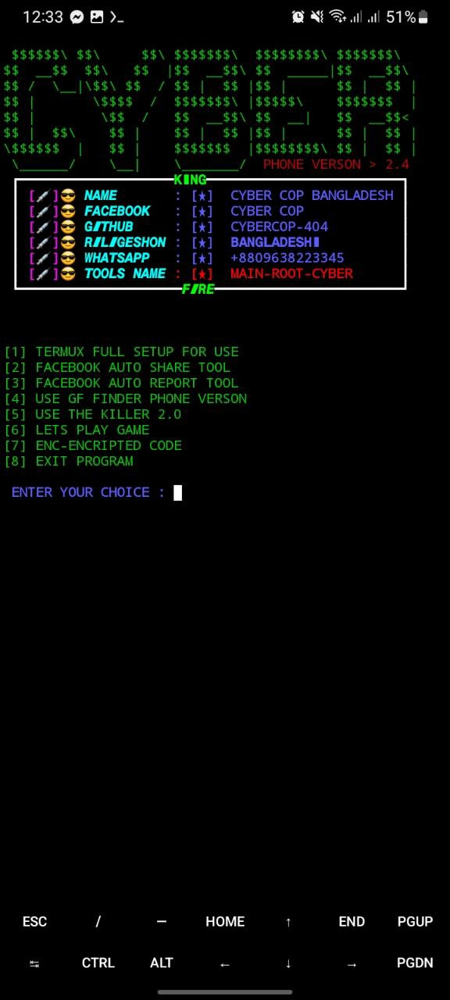
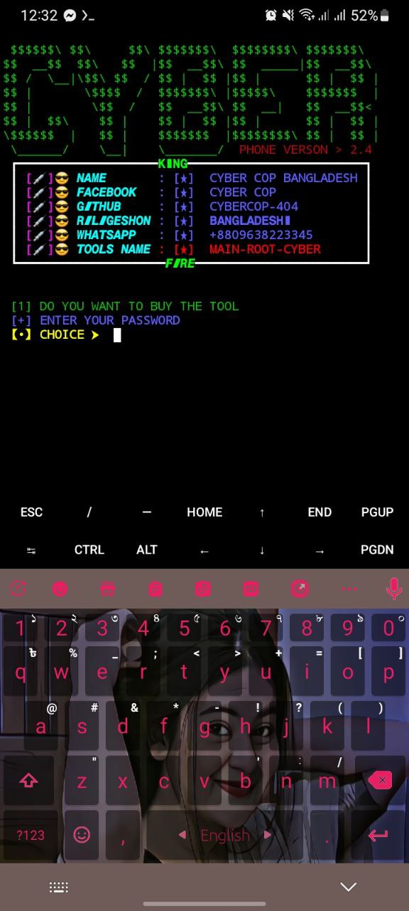
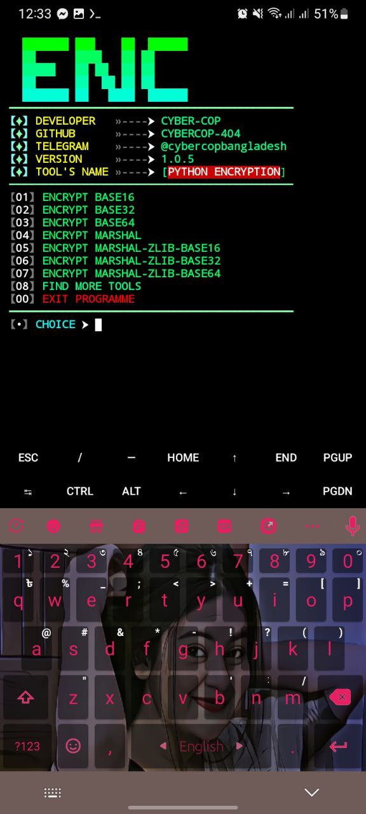
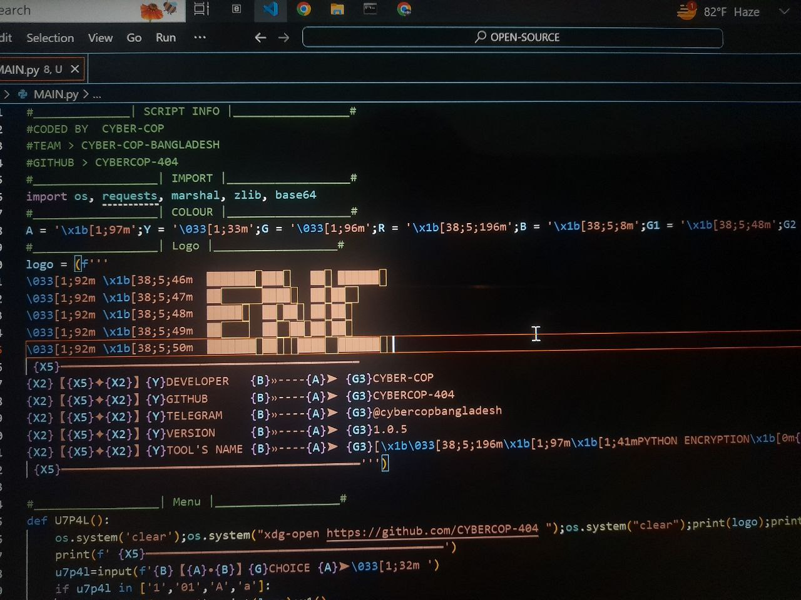
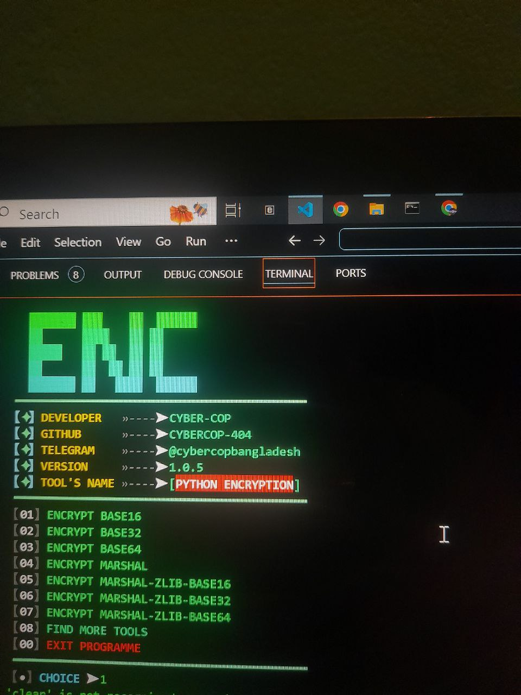

<p align="center">
</p>

</p>
   <p align="center">
      <a href="https://github.com/CYBERCOP-404/MARSHAL/stargazers">
      </a>
      <a href="https://github.com/CYBERCOP-404/MARSHAL/releases/latest">
      </a>
      <a href="https://www.conventionalcommits.org/en/v1.0.0/">
      </a>
      <a href="https://github.com/CYBERCOP-404/MARSHAL/actions/workflows/github-action.yml">
      </a>
   </p>
   
</br>
<h2 align="center">INSTALL TOOL ON TERMUX > </h2><br>
 
```python
apt update && apt upgrade -y
pkg install git
pkg install python
pip install requests
rm -rf MARSHAL
git clone https://github.com/CYBERCOP-404/MARSHAL.git
cd MARSHAL
python marshal.py
```
<p align="center">

<h5 align="center"><b>TERMUX</b></h5>

<p align="center">
<p align="center";> 

<h5 align="center"><b>KALI LINUX</b></h5>
<p align="center">
<p align="center">  
   
<p align="center">

### Tools Languages :

<p align="center">
</p>

# Report bugs
If you notice issues while installing this tool or running this tool kindly mail to me at <a href="mailto: cybercopbangladesh@gmail.com">Gmail</a> or Open an issue via github.

<h5 align="center"><b>DESCRIPTION</b></h5>

* ©️ Copyright Message
>> Copyright © [2023-27] [CYBER-COP]
>All rights reserved. This Python project, along with its code, documentation, and any associated files, is the intellectual property of CYBER-COP. You may not reproduce, distribute, or modify the contents of this repository without explicit permission from the owner.
# Give A Star ⭐

> You can also give this repository a star to show more people and they can use this repository.
